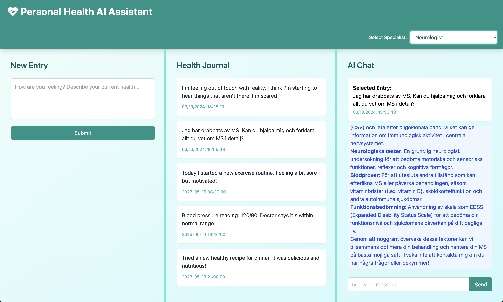

# Personal Health Record AI Assistant

## Project Overview

This Electron app will serve as a personal electronic health record (EHR) system, allowing users to track their health, record symptoms, add measurements, and interact with an AI for health insights.

## Features
1. User-friendly interface for data entry
2. Secure storage of personal health information
3. AI-powered analysis and recommendations
4. Data visualization and reporting
5. Cross-platform compatibility (Mac and PC)

## Technology Stack
- Electron: For cross-platform desktop app development
- React: For building the user interface
- Node.js: For backend operations
- SQLite: For local data storage
- OpenAI API: For AI-powered health insights
